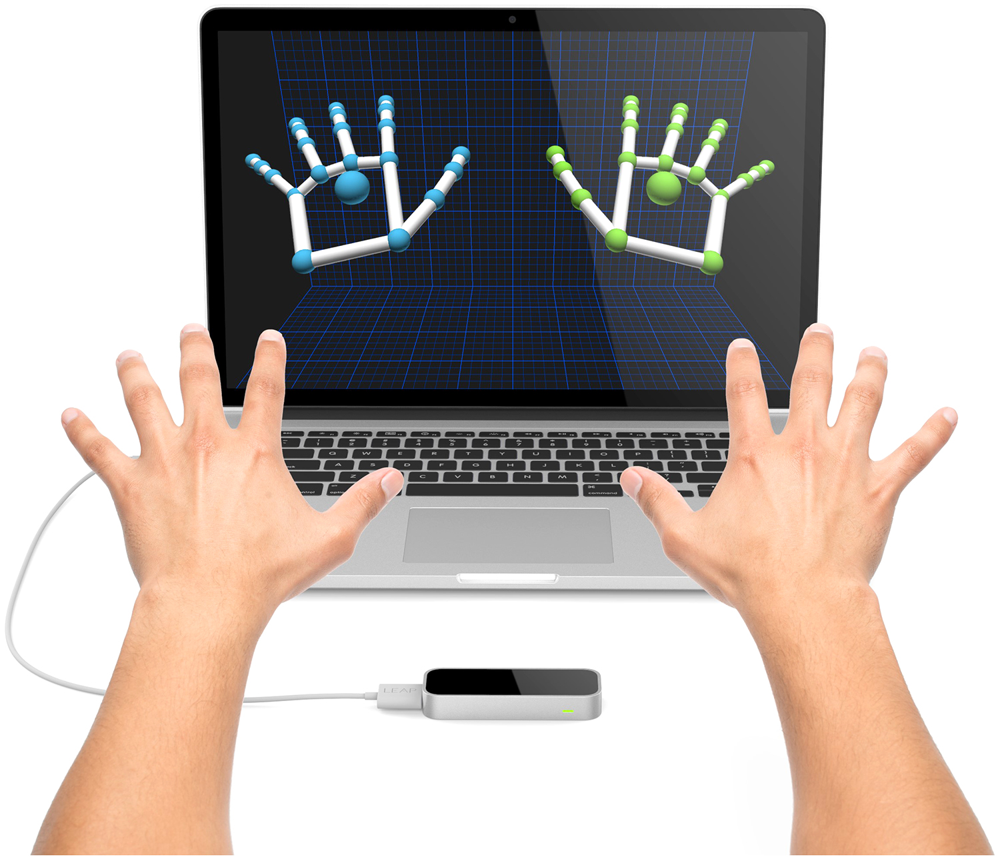

# Leap Motion Experiments

Python experiments with the Leap Motion controller for a college project.

Python version: 2.7

All dependencies are inside the *requirements.txt* file.

Tested on Leap Motion Orion API (3.2.1) and Windows 10.

[Python API Documentation](https://developer-archive.leapmotion.com/documentation/python/index.html)

## Usage and installation

1. Install the Leap Motion Orion API
2. Connect the Leap Motion controller
3. Run Python scripts

## Scripts

* cursor_control.py - used for controlling the mouse cursor with your palm
* deformable_object_recorder.py - used for recording the index finger position when deforming an object and plotting the results in x,y and z directions against time
* hand_movement_recorder.py - used for recording the palm position and plotting the results in x,y and z directions against time as well as speed in all mentioned directions
* powerpoint_slideshow_control.py - used for controlling an open PowerPoint slideshow with a left hand grab (previous slide) or right hand grab (next slide)
* solidworks_viewport_movement_and_zoom.py - used for controlling a Solidworks CAD viewport
* solidworks_viewport_movement.py - used for controlling a Solidworks CAD viewport
* solidworks_viewport_zoom.py - used for controlling a Solidworks CAD viewport
